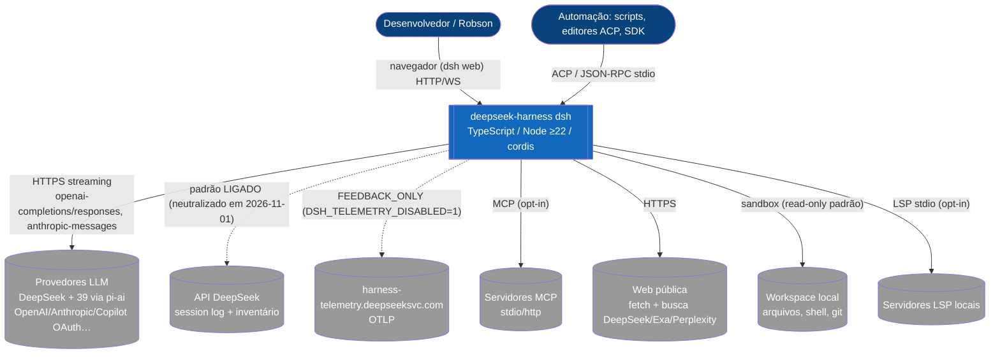
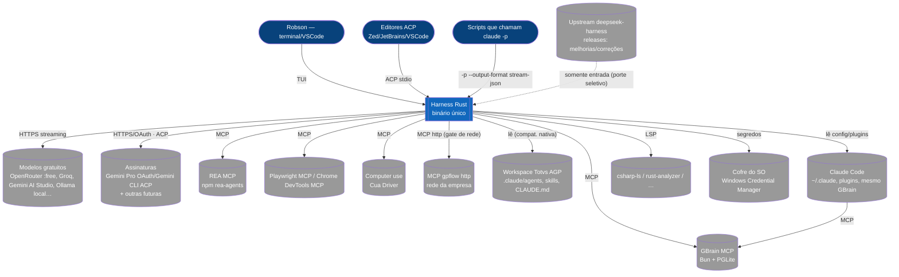

# C4 — Nível 1: Contexto

## 1. Como é hoje (deepseek-harness / dsh) 🟢

```mermaid
flowchart TB
  U([Desenvolvedor / Robson]):::person
  AUT([Automação: scripts, editores ACP, SDK]):::person
  DSH[[deepseek-harness dsh\nTypeScript / Node ≥22 / cordis]]:::sys
  LLM[(Provedores LLM\nDeepSeek + 39 via pi-ai\nOpenAI/Anthropic/Copilot OAuth…)]:::ext
  DS[(API DeepSeek\nsession log + inventário)]:::ext
  OTEL[(harness-telemetry.deepseeksvc.com\nOTLP)]:::ext
  MCP[(Servidores MCP\nstdio/http)]:::ext
  WEB[(Web pública\nfetch + busca DeepSeek/Exa/Perplexity)]:::ext
  FS[(Workspace local\narquivos, shell, git)]:::ext
  LSP[(Servidores LSP locais)]:::ext

  U -- "navegador (dsh web) HTTP/WS" --> DSH
  AUT -- "ACP / JSON-RPC stdio" --> DSH
  DSH -- "HTTPS streaming\nopenai-completions/responses, anthropic-messages" --> LLM
  DSH -. "padrão LIGADO (neutralizado em 2026-11-01)" .-> DS
  DSH -. "FEEDBACK_ONLY (DSH_TELEMETRY_DISABLED=1)" .-> OTEL
  DSH -- "MCP (opt-in)" --> MCP
  DSH -- HTTPS --> WEB
  DSH -- "sandbox (read-only padrão)" --> FS
  DSH -- "LSP stdio (opt-in)" --> LSP
  classDef person fill:#08427b,color:#fff
  classDef sys fill:#1168bd,color:#fff
  classDef ext fill:#999,color:#fff
```

## 2. Alvo (harness Rust) 🟡

```mermaid
flowchart TB
  U([Robson — terminal/VSCode]):::person
  ED([Editores ACP\nZed/JetBrains/VSCode]):::person
  SC([Scripts que chamam claude -p]):::person
  H[[Harness Rust\nbinário único]]:::sys
  FREE[(Modelos gratuitos\nOpenRouter :free, Groq, Gemini AI Studio, Ollama local…)]:::ext
  SUB[(Assinaturas\nGemini Pro OAuth/Gemini CLI ACP\n+ outras futuras)]:::ext
  UP[(Upstream deepseek-harness\nreleases: melhorias/correções)]:::ext
  REA[(REA MCP\nnpm rea-agents)]:::ext
  GB[(GBrain MCP\nBun + PGLite)]:::ext
  BR[(Playwright MCP / Chrome DevTools MCP)]:::ext
  CU[(Computer use\nCua Driver)]:::ext
  GPF[(MCP gpflow http\nrede da empresa)]:::ext
  TOTVS[(Workspace Totvs AGP\n.claude/agents, skills, CLAUDE.md)]:::ext
  CC[(Claude Code\n~/.claude, plugins, mesmo GBrain)]:::ext
  LSP[(csharp-ls / rust-analyzer / …)]:::ext
  KR[(Cofre do SO\nWindows Credential Manager)]:::ext

  U -- TUI --> H
  ED -- "ACP stdio" --> H
  SC -- "-p --output-format stream-json" --> H
  H -- "HTTPS streaming" --> FREE
  H -- "HTTPS/OAuth · ACP" --> SUB
  UP -. "somente entrada (porte seletivo)" .-> H
  H -- MCP --> REA
  H -- MCP --> GB
  H -- MCP --> BR
  H -- MCP --> CU
  H -- "MCP http (gate de rede)" --> GPF
  H -- "lê (compat. nativa)" --> TOTVS
  H -- "lê config/plugins" --> CC
  CC -- MCP --> GB
  H -- LSP --> LSP
  H -- segredos --> KR
  classDef person fill:#08427b,color:#fff
  classDef sys fill:#1168bd,color:#fff
  classDef ext fill:#999,color:#fff
```
**Nenhuma seta de saída de dados para a DeepSeek** (ADR 101).
