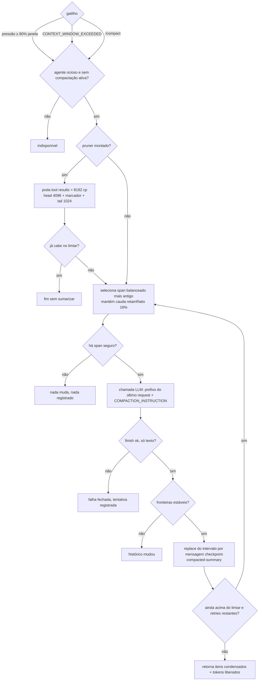
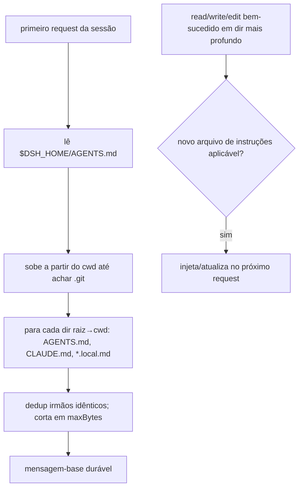

# Fluxogramas — módulos `compaction` e `context`

## 1. Compactação (`compaction-basic`) 🟢

```mermaid
flowchart TD
  A{gatilho} -->|pressão ≥ 80% janela| B
  A -->|CONTEXT_WINDOW_EXCEEDED| B
  A -->|/compact| B
  B{agente ocioso e sem compactação ativa?} -- não --> X1[indisponível]
  B -- sim --> P{pruner montado?}
  P -- sim --> P1[poda tool results > 8192 cp<br/>head 4096 + marcador + tail 1024]
  P1 --> P2{já cabe no limiar?}
  P2 -- sim --> OK[fim sem sumarizar]
  P2 -- não --> S
  P -- não --> S[seleciona span balanceado mais antigo<br/>mantém cauda retainRatio 16%]
  S --> S1{há span seguro?}
  S1 -- não --> NOP[nada muda, nada registrado]
  S1 -- sim --> L[chamada LLM: prefixo do último request + COMPACTION_INSTRUCTION]
  L --> V{finish ok, só texto?}
  V -- não --> F[falha fechada, tentativa registrada]
  V -- sim --> ST{fronteiras estáveis?}
  ST -- não --> F2[histórico mudou]
  ST -- sim --> R[replace do intervalo por mensagem checkpoint<br/>compacted-summary]
  R --> Q{ainda acima do limiar e retries restantes?}
  Q -- sim --> S
  Q -- não --> OK2[retorna itens condensados + tokens liberados]
```

## 2. Instruções do projeto (`agent-instructions`) 🟢

```mermaid
flowchart TD
  A[primeiro request da sessão] --> B[lê $DSH_HOME/AGENTS.md]
  B --> C[sobe a partir do cwd até achar .git]
  C --> D[para cada dir raiz→cwd: AGENTS.md, CLAUDE.md, *.local.md]
  D --> E[dedup irmãos idênticos; corta em maxBytes]
  E --> F[mensagem-base durável]
  G[read/write/edit bem-sucedido em dir mais profundo] --> H{novo arquivo de instruções aplicável?}
  H -- sim --> I[injeta/atualiza no próximo request]
```
