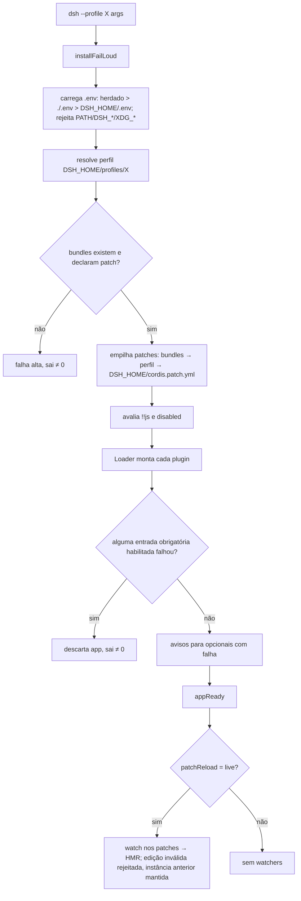
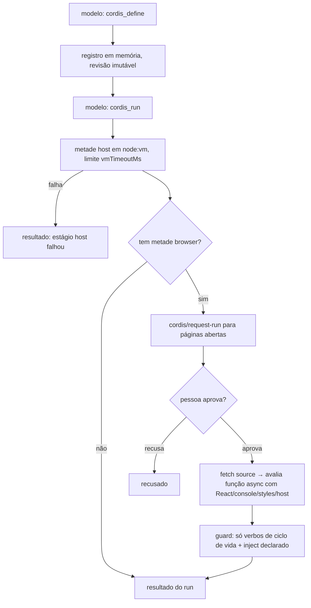

# Fluxogramas — `boot`, `bundle`, `extensions`

## 1. Boot de um perfil 🟢

```mermaid
flowchart TD
  A[dsh --profile X args] --> B[installFailLoud]
  B --> C[carrega .env: herdado > ./.env > DSH_HOME/.env; rejeita PATH/DSH_*/XDG_*]
  C --> D[resolve perfil DSH_HOME/profiles/X]
  D --> E{bundles existem e declaram patch?}
  E -- não --> X1[falha alta, sai ≠ 0]
  E -- sim --> F[empilha patches: bundles → perfil → DSH_HOME/cordis.patch.yml]
  F --> G[avalia !!js e disabled]
  G --> H[Loader monta cada plugin]
  H --> I{alguma entrada obrigatória habilitada falhou?}
  I -- sim --> X2[descarta app, sai ≠ 0]
  I -- não --> J[avisos para opcionais com falha]
  J --> K[appReady]
  K --> L{patchReload = live?}
  L -- sim --> M[watch nos patches → HMR; edição inválida rejeitada, instância anterior mantida]
  L -- não --> N[sem watchers]
```

## 2. Execução de um pacote cordis dinâmico 🟢

```mermaid
flowchart TD
  A[modelo: cordis_define] --> B[registro em memória, revisão imutável]
  B --> C[modelo: cordis_run]
  C --> D[metade host em node:vm, limite vmTimeoutMs]
  D -- falha --> X[resultado: estágio host falhou]
  D --> E{tem metade browser?}
  E -- não --> R[resultado do run]
  E -- sim --> F[cordis/request-run para páginas abertas]
  F --> G{pessoa aprova?}
  G -- recusa --> Y[recusado]
  G -- aprova --> H[fetch source → avalia função async com React/console/styles/host]
  H --> I[guard: só verbos de ciclo de vida + inject declarado]
  I --> R
```
