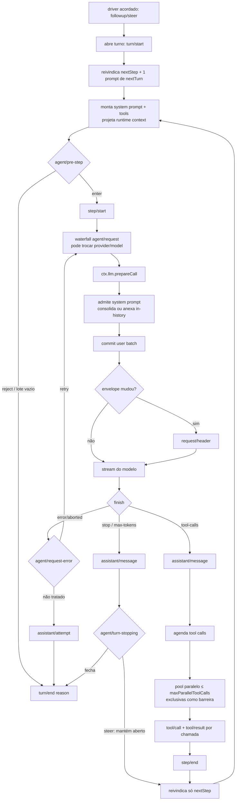
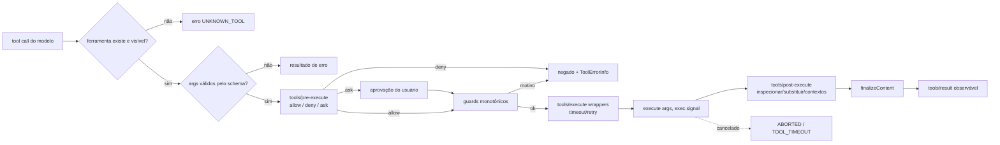
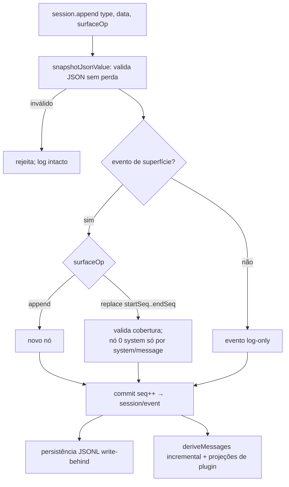

# Fluxogramas — módulo `core`

## 1. Turno e passo do loop ReAct (`agent-loop/src/agent.ts`) 🟢

```mermaid
flowchart TD
  W[driver acordado: followup/steer] --> T0[abre turno: turn/start]
  T0 --> C1[reivindica nextStep + 1 prompt de nextTurn]
  C1 --> S0[monta system prompt + tools<br/>projeta runtime context]
  S0 --> PS{agent/pre-step}
  PS -- reject / lote vazio --> TE
  PS -- enter --> S1[step/start]
  S1 --> R1[waterfall agent/request<br/>pode trocar provider/model]
  R1 --> R2[ctx.llm.prepareCall]
  R2 --> A1[admite system prompt<br/>consolida ou anexa in-history]
  A1 --> A2[commit user batch]
  A2 --> H{envelope mudou?}
  H -- sim --> H1[request/header]
  H -- não --> ST
  H1 --> ST[stream do modelo]
  ST --> F{finish}
  F -- error/aborted --> RE{agent/request-error}
  RE -- retry --> R1
  RE -- não tratado --> AT[assistant/attempt] --> TE
  F -- stop / max-tokens --> AM[assistant/message] --> TS{agent/turn-stopping}
  TS -- steer: mantém aberto --> C2
  TS -- fecha --> TE[turn/end reason]
  F -- tool-calls --> AM2[assistant/message] --> TC[agenda tool calls]
  TC --> TP[pool paralelo ≤ maxParallelToolCalls<br/>exclusivas como barreira]
  TP --> TR[tool/call + tool/result por chamada]
  TR --> SE[step/end]
  SE --> C2[reivindica só nextStep] --> S0
```

## 2. Pipeline de execução de ferramenta (`core/tools`) 🟢

```mermaid
flowchart LR
  A[tool call do modelo] --> B{ferramenta existe e visível?}
  B -- não --> E1[erro UNKNOWN_TOOL]
  B -- sim --> V{args válidos pelo schema?}
  V -- não --> E2[resultado de erro]
  V -- sim --> P[tools/pre-execute<br/>allow / deny / ask]
  P -- deny --> E3[negado + ToolErrorInfo]
  P -- ask --> U[aprovação do usuário] --> G
  P -- allow --> G[guards monotônicos]
  G -- motivo --> E3
  G -- ok --> X[tools/execute wrappers<br/>timeout/retry] --> BODY[execute args, exec.signal]
  BODY --> PO[tools/post-execute<br/>inspecionar/substituir/contextos]
  PO --> FC[finalizeContent] --> R[tools/result observável]
  BODY -. cancelado .-> AB[ABORTED / TOOL_TIMEOUT]
```

## 3. Sessão: append e derivação 🟢

```mermaid
flowchart TD
  A[session.append type, data, surfaceOp] --> B[snapshotJsonValue: valida JSON sem perda]
  B -- inválido --> X[rejeita; log intacto]
  B --> C{evento de superfície?}
  C -- sim --> D{surfaceOp}
  D -- append --> E[novo nó]
  D -- replace startSeq..endSeq --> F[valida cobertura;<br/>nó 0 system só por system/message]
  C -- não --> G[evento log-only]
  E --> H[commit seq++ → session/event]
  F --> H
  G --> H
  H --> I[persistência JSONL write-behind]
  H --> J[deriveMessages incremental + projeções de plugin]
```
